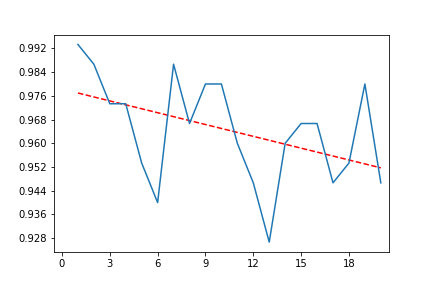
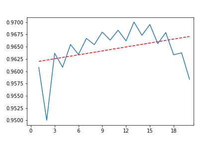

# Homework 1

## Team Members
Samuel Lindsay, lindsays15@students.ecu.edu<br>
Ian Lozano Diaz, lozanodiazi20@students.ecu.edu<br>
Thaddaeus Parchman, parchmant18@students.ecu.edu<br>

## Run Instructions

### Dependencies

Required Python modules.
``` Python
numpy
sklearn
matplotlib
```

### Running

Two files that can be run are included, a jupyter notebook file and python file. To run using jupyter, load the file and execute each cell interactively. To Run the Python file under a Unix environment use the command below where the version of python is =>3.7.

``` bash
python ./knn.py
```

### Run Parameters

While crude, the user does have the ability to modify two runtime parameters with relative ease. Under a section titled "Options", in both the notebook and Python file, there is a variable "trials", this is initially set at 5 but can be easily modified by the user. We conducted several runs with this variable set to a value of 1000. The second parameters is the name of the output plot, coltrolled by the variable "plot_name", also in the "Options" section.

## Questions

### Which K (from 1 to 20) works the best? If all Ks have similar accuracy, please write down your thoughts about “Why.”

We found that a run of only five trials per k was insufficient for stable reproduction of trends. We became curious and expanded the number of trials greatly, to 1000. Graphs of 5 trials and 1000 trials are both provided below. Multiple reproductions of the 1000 trial graph demonstrated a maximum accuracy in the range of 1 <= k <= 4. In our observations a k of 3 was most frequently the highest scoring for the 1000 trial runs. We hypothesize that this is the case because the categories are distinctly clustered from each other. Thus, it requires little information to group them. A k above a threshold ~4 can have a relatively large negative impact.


k = 5                      |  k = 1000
:-------------------------:|:-------------------------:
                |  

