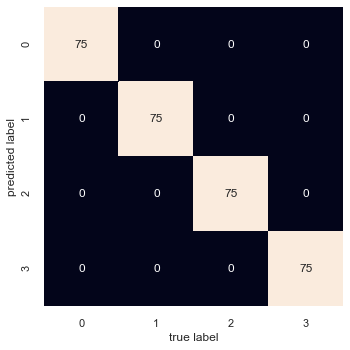

# Homework 2

## Team Member Information

Samuel Lindsay, lindsays15@students.ecu.edu <br />
Ian Lozano Diaz, lozanodiazi20@students.ecu.edu <br />
Thaddaeus Parchman, parchmant18@students.ecu.edu <br />

## Quick Start

### Dependencies

``` python
sklearn
yellowbrick
numpy
scipy
matplotlib
seaborn
```

### Running

You can execute the cells of the included jupyter notebook as
long as you have the dependencies installed. 

## Questions

### Which k works the best?

Four was found to be the optimal value of k.

### Best k accuracy

The best k had an accuraccy of 100% on the test data. This was hard to accept at first. We then recognized that the data generated was 4 ideal clusters.

### Confuction matrix

A confusion matrix will be rendered within the jupyter notebook when it is run. An image of that matrix is also included below.


