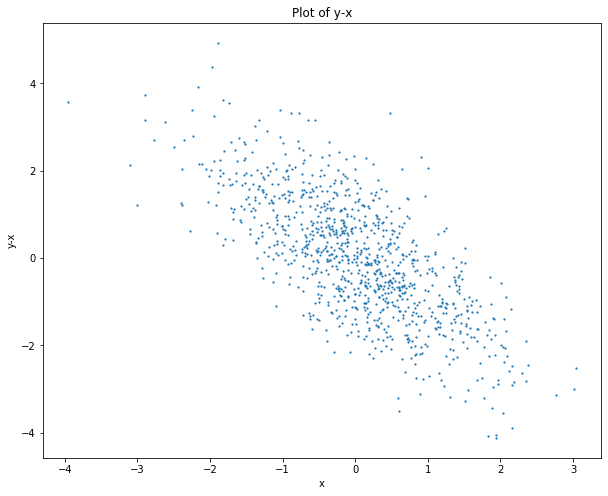
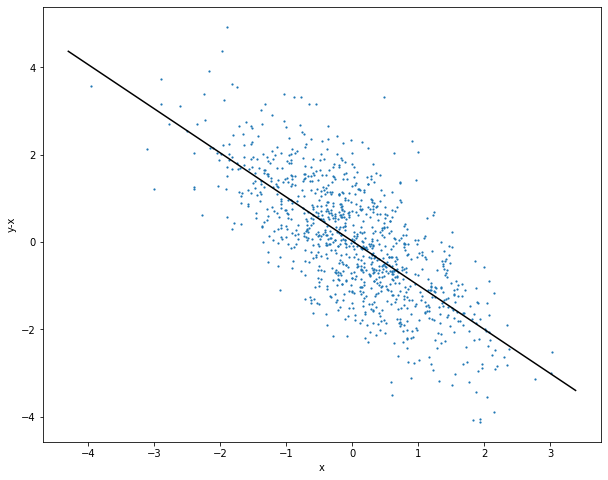

# Homework 2

## Team Member Information

Samuel Lindsay, lindsays15@students.ecu.edu <br />
Ian Lozano Diaz, lozanodiazi20@students.ecu.edu <br />
Thaddaeus Parchman, parchmant18@students.ecu.edu <br />

## Quick Start

The assignment description did not say that the notebook should be included
in the repo folder. Went ahead and included it, just in case.

### Dependencies

``` python
matplotlib
scipy
numpy
math
pandas
numpy
```

### Running

Execute the cells of the included notebook. Provided that all required 
dependencies are installed. 

## Graphs

The resulting graphs from exercises 1 and 2 are found below. It is worth
noting that the axes may seem absent from the graph. This is due to 
the GitHub darkmode (which I believe is the default now? I don't remember
turning it on). They are present and if you hit the image download button
or copy and paste the image into a Word doc you can see the aforementioned
elusive axes.



